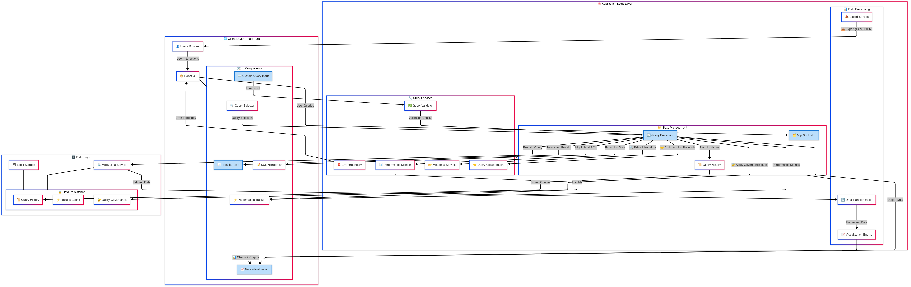
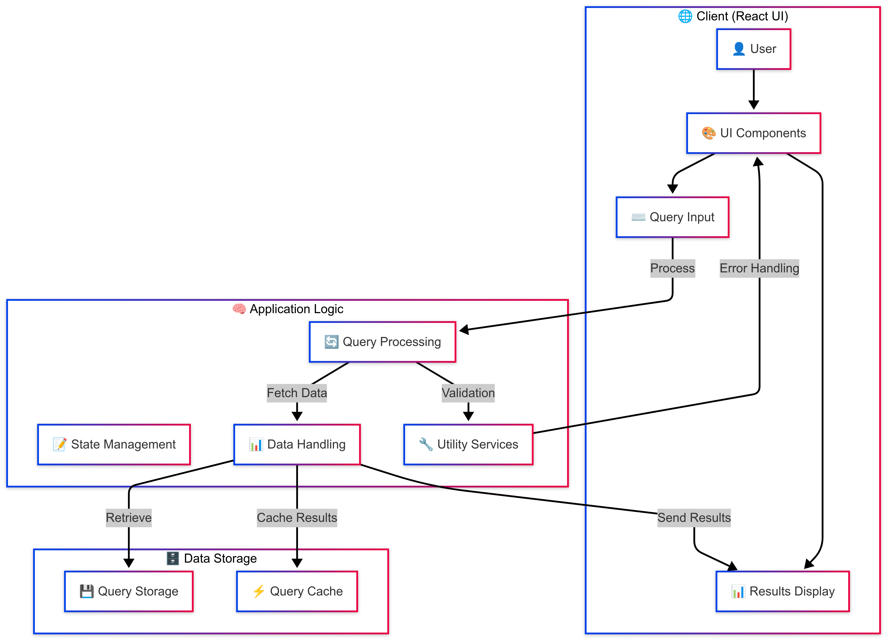
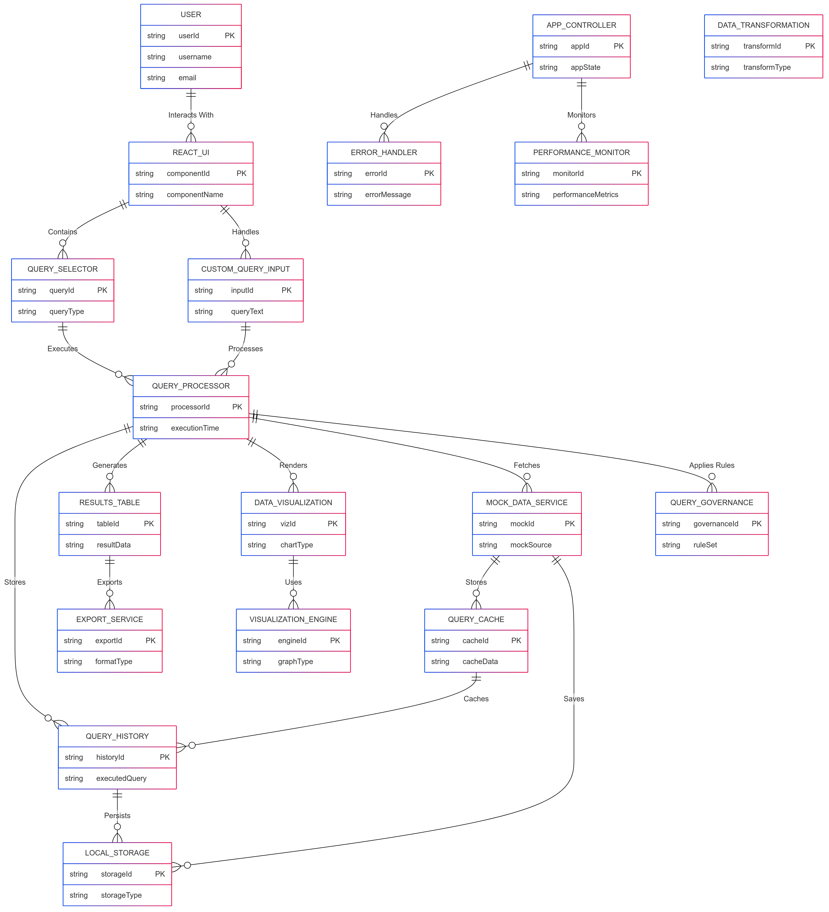
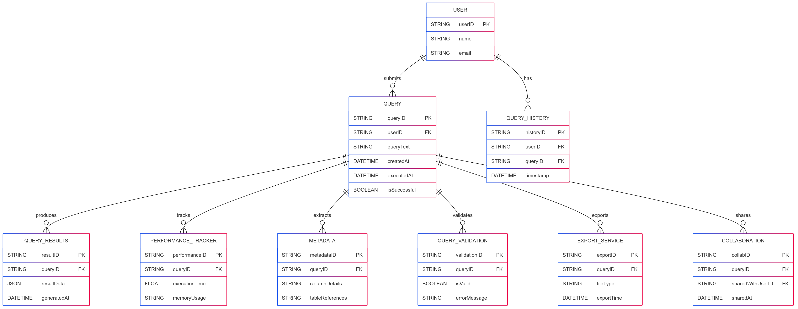

# 🚀 Frontend SQL Query Viewer
----------------------------------------------

## 📌 Project Overview (Atlan Frontend Internship Task 2025)
-------------------------------------------------------------
Atlan Frontend SQL Query Viewer is a powerful web-based application designed for data analysts and developers to explore, execute, and visualize SQL queries interactively. With an intuitive UI and advanced visualization features, it enhances data exploration and performance monitoring.

## 🛠 Tech Stack
----------------
- **Framework**: React (create-react-app)
- **UI Library**: Material-UI (MUI)
- **Charting**: Recharts
- **Performance Tracking**: Web Vitals
- **State Management**: React Hooks
- **Storage**: Browser's localStorage for query history

## 🌟 Key Features
-------------------
- 💻 **Custom SQL Query Input**: Write and execute queries with ease.
- 💜 **Predefined Query Selection**: Quickly access common queries.
- 📂 **Interactive Query History**: View and re-run previous queries.
- 📊 **Advanced Data Visualization**: Graphs and charts using Recharts.
- ⚡ **Performance Analysis**: Track web vitals for performance insights.
- 📥 **CSV Export**: Export query results for further analysis.
- ✨ **Syntax Highlighted Queries**: Improved readability for complex queries.
- 📱 **Responsive Design**: Optimized for all screen sizes.

## 🏠 System Architecture
--------------------------
The architecture of the Atlan Frontend SQL Query Viewer is designed to ensure smooth user interactions and efficient data visualization.

### **Architecture Diagram**

---> For simple representation

- The system follows a component-based architecture using React.
- The state management is handled using React Hooks.
- The UI is built with Material-UI for better responsiveness.
- Query results are stored in localStorage to improve performance.
- Performance metrics are tracked using Web Vitals.

## 📊 ER Diagram
-----------------
The **Entity-Relationship (ER) Diagram** below illustrates the structure of stored query data.

### **ER Diagram**

---> For simple representation

- Queries are stored in **localStorage**.
- Each query includes:
  - **Query ID** (Unique identifier)
  - **Query String** (User input SQL query)
  - **Timestamp** (Execution time)
  - **Result Data** (Simulated output)
- Predefined queries are also maintained for easy selection.

## 📊 Performance Metrics
---------------------------
### Page Load Time Measurement
Integrated `reportWebVitals.js` to track:
- **Cumulative Layout Shift (CLS)**
- **First Input Delay (FID)**
- **First Contentful Paint (FCP)**
- **Largest Contentful Paint (LCP)**
- **Time to First Byte (TTFB)**

### Optimization Techniques
---------------------------
1. **Code Splitting**: Used `React.lazy()` for component-level code splitting.
2. **Caching**: Implemented localStorage for efficient query history retrieval.
3. **Minimal Re-renders**: Leveraged `useMemo` and `useCallback` to optimize performance.
4. **Lazy Loading**: Decreased initial load time by deferring heavy components.
5. **Responsive UI**: Built with Material-UI's grid system for a seamless experience.

## 🚀 Deployment
-----------------
- **Platform**: Vercel
- **Live URL**: [Your Deployed App URL]

## 🛠 Local Setup
-----------------
### Prerequisites
- Node.js (v14 or later)
- npm or yarn

### Installation Steps
1. Clone the repository:
   ```bash
   git clone [your-repo-url]
   cd [project-directory]
   ```
2. Install dependencies:
   ```bash
   npm install
   # or
   yarn install
   ```
3. Start the development server:
   ```bash
   npm start
   # or
   yarn start
   ```

## 🖍 Dependencies
- `react`: ^18.0.0
- `@mui/material`: ^5.x
- `@mui/icons-material`: ^5.x
- `recharts`: ^2.x
- `web-vitals`: ^2.x

## 🤍 Testing
- Integrated error boundary handling.
- Performance monitoring with Web Vitals.
- Responsive design tested across multiple devices.

## 🔍 Browser Compatibility
👉 Chrome  
👉 Firefox  
👉 Safari  
👉 Edge  

## 📞 Contact
--------------
**YOKESHWARAN S**  
📧 wsyokesh@gmail.com  
🔗 [LinkedIn](https://linkedin.com/in/yokeshwaran-s-38893825b/)


### **Note to Atlan Team**
---------------------------
This project demonstrates a strong understanding of frontend development, emphasizing user experience, performance optimization, and data visualization capabilities.

